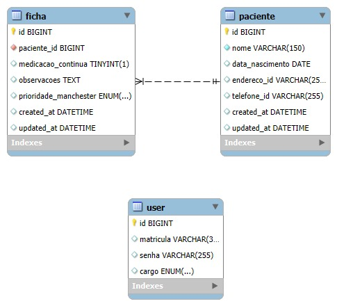

# App-Queue  

  
  
  

## 🌟 Introdução  

**App-Queue** é um aplicativo criado para organizar e gerenciar filas em unidades básicas de saúde. Seu objetivo principal é realizar uma triagem simples, organizar os pacientes em uma fila por gravidade do problema e facilitar o trabalho das equipes de saúde, incluindo a **Secretaria**, **Enfermagem** e **Médicos**.  

---

## 🚀 Funcionalidades  

- 👩‍⚕️ **Triagem de Pacientes**: Permite uma triagem rápida e simples dos pacientes.  
- 🏥 **Fila por Gravidade**: Organização automática da fila baseada na gravidade do problema informado.  
- 🔒 **Acesso Restrito**: Apenas usuários autorizados (Secretaria, Enfermagem e Médicos) podem acessar o sistema.  
- 📊 **Interface Intuitiva**: Telas específicas para cada função do profissional de saúde.  

---
## 📱 Visualizações do Aplicativo

- **Tela de Login**  
  

- **Tela de Triagem**  
  

- **Tela do Médico**  
  

  

## 🛠️ Instalação  

1. Certifique-se de ter Flutter SDK e Dart instalados.  
2. Clone o repositório:  
   ```bash
   git clone https://github.com/alexandrendev/app-queue.git
   cd app-queue
   ```

3. Instale as dependências:  
   ```bash
   flutter pub get
   ```

4. Rode o aplicativo em um dispositivo ou emulador:  
   ```bash
   flutter run
   ```
### 🗂️ Estrutura do Projeto

A estrutura de diretórios do projeto foi organizada de forma a facilitar a manutenção e escalabilidade. Abaixo está a descrição detalhada dos principais diretórios e arquivos:

```plaintext
app_queue/  
├── android/                         # Código específico para a plataforma Android  
├── lib/                             # Código fonte do aplicativo Flutter  
│   ├── assets/images/               # Imagens e recursos estáticos  
│   │   └── logo.png                 # Logo do aplicativo  
│   ├── cfg/                         # Arquivos de configuração  
│   │   └── back_4_app.dart          # Configuração de conexão com o backend  
│   ├── components/                  # Componentes reutilizáveis da interface  
│   │   ├── my_button.dart           # Componente de botão personalizado  
│   │   ├── my_checkBox.dart         # Componente de checkbox personalizado  
│   │   ├── my_dropdown.dart         # Componente de dropdown personalizado  
│   │   ├── my_logo.dart             # Componente de logo personalizado  
│   │   ├── my_person.dart           # Componente de pessoa (por exemplo, paciente)  
│   │   ├── my_priority.dart         # Componente de prioridade de atendimento  
│   │   └── my_text_input.dart       # Componente de campo de entrada de texto  
│   ├── controller/                  # Lógica de controle (controllers)  
│   │   └── paciente_controller.dart # Controlador para manipulação dos dados dos pacientes  
│   ├── db/                          # Arquivos de configuração de banco de dados  
│   │   └── connection_b4a.dart      # Configuração da conexão com o banco de dados  
│   ├── model/                       # Modelos de dados utilizados no app  
│   │   └── paciente_model.dart      # Modelo de dados do paciente  
│   ├── pages/                       # Páginas da aplicação (telas)  
│   │   ├── cadastro_paciente.dart   # Tela de cadastro de paciente  
│   │   ├── cadastro_usuario.dart    # Tela de cadastro de usuário  
│   │   ├── home_atendente.dart      # Tela principal para atendentes  
│   │   ├── home_consultorio.dart    # Tela principal para médicos  
│   │   ├── init_page.dart           # Tela de inicialização  
│   │   ├── login_page.dart          # Tela de login  
│   │   └── triagem.dart             # Tela de triagem de pacientes  
│   ├── themes/                      # Temas (escuro e claro)  
│   │   ├── dark_theme.dart          # Tema escuro  
│   │   └── light_theme.dart         # Tema claro  
│   └── main.dart                    # Arquivo principal que inicializa o app  
├── test/                            # Testes unitários do aplicativo  
├── web/                             # Código específico para a versão web  
├── README.md                        # Arquivo de documentação do projeto  
├── analysis_options.yaml            # Arquivo de configuração de análise do código  
├── pubspec.lock                     # Dependências do projeto (lock file)  
└── pubspec.yaml                     # Arquivo de configuração de dependências do projeto
```

## 📊 Diagrama Entidade-Relacionamento (DER)

O DER do banco de dados foi estruturado para refletir as entidades principais do sistema e como elas se relacionam. Abaixo está a descrição das principais tabelas e seus relacionamentos.

### Diagrama Visual

Aqui está o diagrama do banco de dados que representa essas relações:

<p align="center">
  
</p>


---


## 🤝 Contribuição

Contribuições são bem-vindas!

1. Faça um fork do projeto.  
2. Crie uma branch para sua funcionalidade:

   ```bash
   git checkout -b minha-nova-funcionalidade
   ```

3. Commit suas alterações:

   ```bash
   git commit -m 'Descrição da funcionalidade'
   ```

4. Envie para o repositório original:

   ```bash
   git push origin minha-nova-funcionalidade
   ```

5. Abra um Pull Request.


---

## 📝 Licença

Este projeto está sob a licença MIT. Veja o arquivo [LICENSE](./LICENSE) para mais detalhes.

---

👨‍💻 Desenvolvido por:

- 
- 


